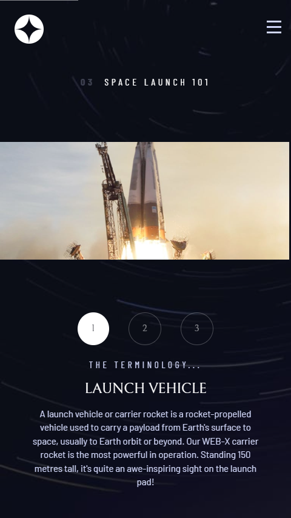
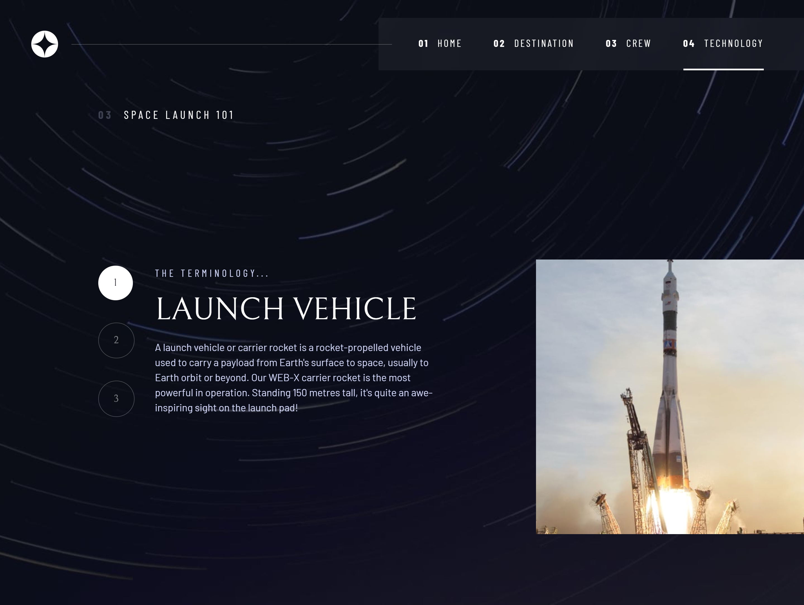

# Frontend Mentor - Space tourism website solution

This is a solution to the [Space tourism website challenge on Frontend Mentor](https://www.frontendmentor.io/challenges/space-tourism-multipage-website-gRWj1URZ3). Frontend Mentor challenges help you improve your coding skills by building realistic projects. 

## Table of contents

- [Overview](#overview)
  - [The challenge](#the-challenge)
  - [Screenshot](#screenshot)
  - [Links](#links)
- [My process](#my-process)
  - [Built with](#built-with)
  - [What I learned](#what-i-learned)
- [Author](#author)

### The challenge

Users should be able to:

- View the optimal layout for each of the website's pages depending on their device's screen size
- See hover states for all interactive elements on the page
- View each page and be able to toggle between the tabs to see new information

### Screenshot

### Links

- Solution URL: [Github Files](https://github.com/AmbaliOladele/FrontendMentor_Projects/space_tourism)
- Live Site URL: [Space tourism site](https://spacetourismfr.netlify.app/)

## My process

### Built with

- Semantic HTML5 markup
- CSS custom properties
- Flexbox
- CSS Grid
- Mobile-first workflow

### What I learned

Vanilla CSS has soooo much too offer than we can imagine

## Author

- Frontend Mentor - [@AmbaliOladele](https://www.frontendmentor.io/profile/AmbaliOladele)
- linkedin - [Ambali Ridwan](https://www.linkedin.com/in/ambali-ridwan-936065228/)