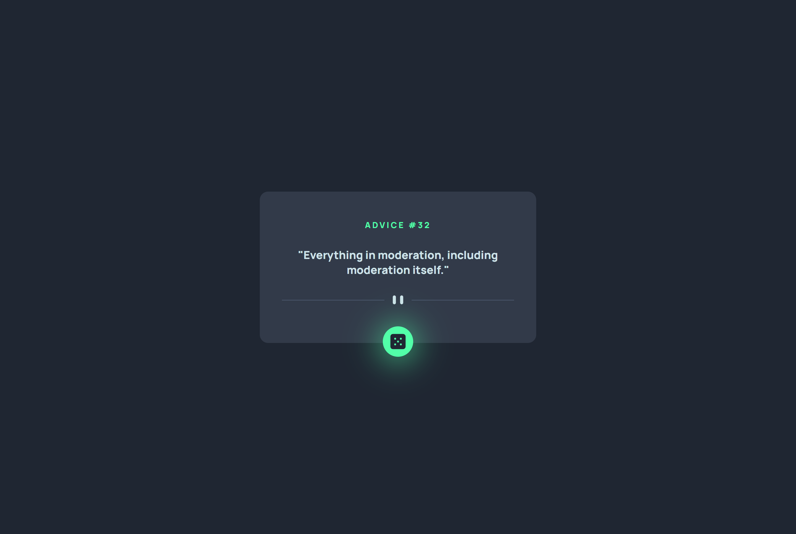

# Frontend Mentor - Advice generator app solution

This is a solution to the [Advice generator app challenge on Frontend Mentor](https://www.frontendmentor.io/challenges/advice-generator-app-QdUG-13db). Frontend Mentor challenges help you improve your coding skills by building realistic projects.

## Table of contents

- [Overview](#overview)
  - [The challenge](#the-challenge)
  - [Screenshot](#screenshot)
  - [Links](#links)
- [My process](#my-process)
  - [Built with](#built-with)
  - [What I learned](#what-i-learned)
  - [Continued development](#continued-development)
  - [Useful resources](#useful-resources)
- [Author](#author)
- [Acknowledgments](#acknowledgments)

## Overview

### The challenge

Users should be able to:

- View the optimal layout for the app depending on their device's screen size
- See hover states for all interactive elements on the page
- Generate a new piece of advice by clicking the dice icon

### Screenshot

### Links

- Solution URL: [Solution URL](https://www.frontendmentor.io/challenges/advice-generator-app-QdUG-13db/solutions/new)
- Live Site URL: [Advice Generator](https://fradvice-generator.netlify.app/)

## My process

### Built with

- Semantic HTML5 markup
- CSS custom properties
- Flexbox
- Mobile-first workflow
- Javascript 
- Asyncronous js(async and await)

### What I learned

Understood Using Apis (Its Fun)

## Author

- Website - [Advice App](https://fradvice-generator.netlify.app/)
- Frontend Mentor - [@AmbaliOladele](https://www.frontendmentor.io/profile/AmbaliOladele)
- Linkedin - [Ambali Ridwan](https://www.linkedin.com/in/ambali-ridwan-936065228/)
