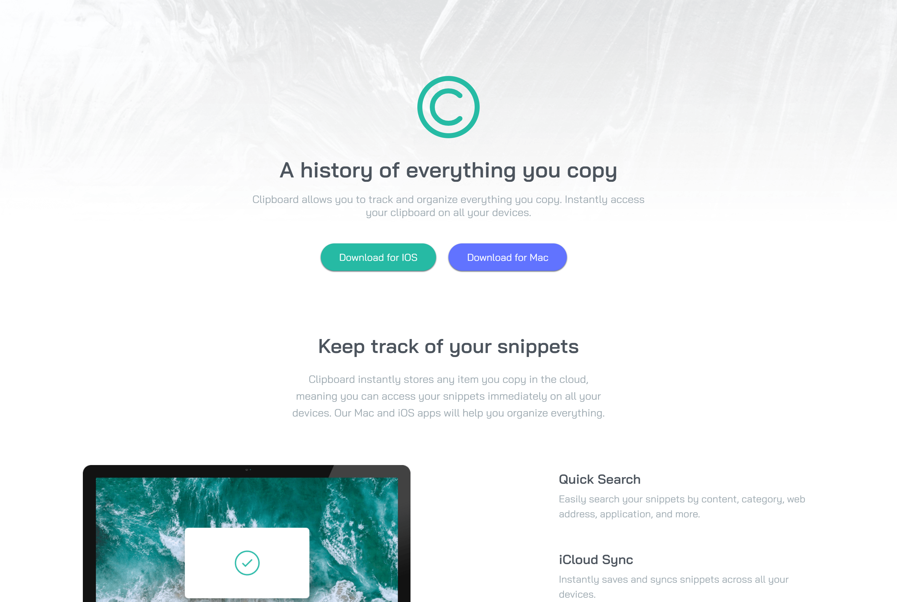

# Frontend Mentor - Clipboard landing page solution

This is a solution to the [Clipboard landing page challenge on Frontend Mentor](https://www.frontendmentor.io/challenges/clipboard-landing-page-5cc9bccd6c4c91111378ecb9). Frontend Mentor challenges help you improve your coding skills by building realistic projects. 

## Table of contents

- [Overview](#overview)
  - [The challenge](#the-challenge)
  - [Screenshot](#screenshot)
  - [Links](#links)
- [My process](#my-process)
  - [Built with](#built-with)
  - [What I learned](#what-i-learned)

## Overview

### The challenge

Users should be able to:

- View the optimal layout for the site depending on their device's screen size
- See hover states for all interactive elements on the page

### Screenshot

### Links

- Solution URL: [Solutions](https://github.com/AmbaliOladele/FrontendMentor_Projects)
- Live Site URL: [Clipboard Landing Page](https://frclipboardlandingpage.netlify.app)

## My process

### Built with

- Semantic HTML5 markup
- CSS custom properties
- Flexbox
- Mobile-first workflow

### What I learned

More About Responsive Design

## Author

- Website - [Clipboard Landing Page](https://frclipboardlandingpage.netlify.app/)
- Frontend Mentor - [@AmbaliOladele](https://www.frontendmentor.io/profile/AmbaliOladele)
- Linkedin - [Ambali Ridwan](https://www.linkedin.com/in/ambali-ridwan-936065228/)