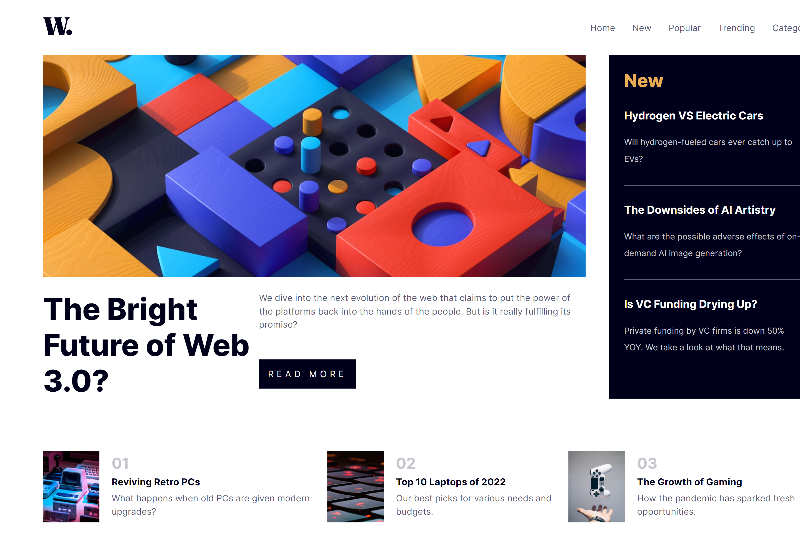

# Frontend Mentor - News homepage solution

This is a solution to the [News homepage challenge on Frontend Mentor](https://www.frontendmentor.io/challenges/news-homepage-H6SWTa1MFl). Frontend Mentor challenges help you improve your coding skills by building realistic projects. 

## Table of contents

- [Overview](#overview)
  - [The challenge](#the-challenge)
  - [Screenshot](#screenshot)
  - [Links](#links)
- [My process](#my-process)
  - [Built with](#built-with)
  - [What I learned](#what-i-learned)
- [Author](#author)

### The challenge

Users should be able to:

- View the optimal layout for the interface depending on their device's screen size
- See hover and focus states for all interactive elements on the page

### Screenshot

### Links

- Solution URL: [so]([https://your-solution-url.com](https://github.com/AmbaliOladele/FrontendMentor_Projects/blob/main/news_homepage/index.html))
- Live Site URL: [News Home Page](https://frmentornewshomepage.netlify.app/)

### Built with

- Semantic HTML5 markup
- CSS custom properties
- Flexbox
- Mobile-first workflow

### What I learned
Further Understood Using Flexbox

## Author

- Website - [news homepage](https://frmentornewshomepage.netlify.app/)
- Frontend Mentor - [@AmbaliOladele](https://www.frontendmentor.io/profile/AmbaliOladele)
- Linkedin - [Ambali Ridwan](https://www.linkedin.com/in/ambali-ridwan-936065228/)
