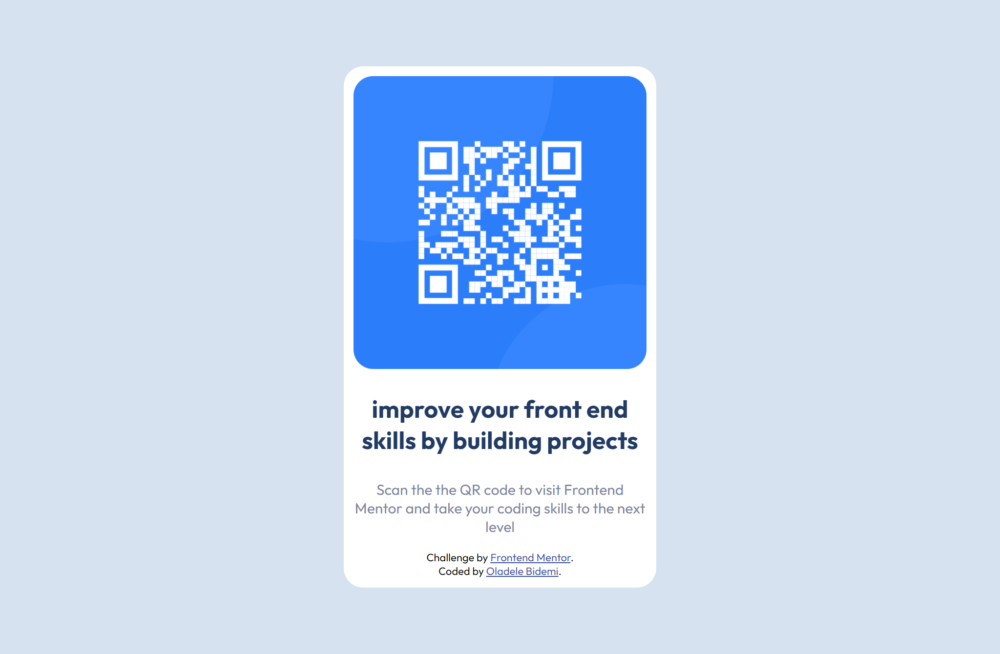

# Frontend Mentor - QR code component solution

## Table of contents

- [Screenshot](#screenshot)
- [Links](#links)
- [Built with](#built-with)
- [What I learned](#what-i-learned)
- [Author](#author)

### Screenshot

### Links

- Solution URL: [Add solution URL here](https://your-solution-url.com)
- Live Site URL: [Add live site URL here](https://your-live-site-url.com)

### Built with

- Semantic HTML5 markup
- CSS custom properties
- Flexbox
- Mobile-first workflow

### What I learned

I further understood how to use css flexbox

## Author

- Website - [Oladele Bidemi](https://www.your-site.com)
- Frontend Mentor - [@AmbaliOladele](https://www.frontendmentor.io/profile/AmbaliOladele)
